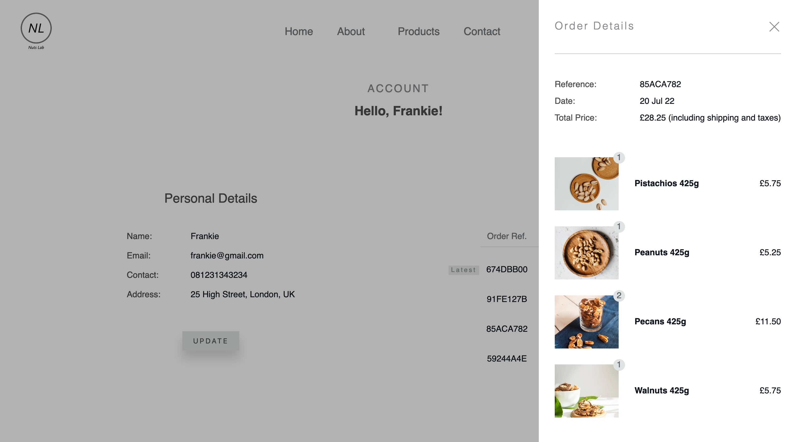

# NextJS App - Nuts Lab

This is a multiple-page application built with React, NextJS and TypeScript. The application serves as a e-commerce website where users can view product items and place an order directly online.

## Table of contents

- [Overview](#overview)
  - [Project background](#project-background)
  - [Website structure](#website-structure)
  - [Screenshot](#screenshot)
  - [Links](#links)
- [My process](#my-process)
  - [Built with](#built-with)
  - [Why I coded this project](#why-i-coded-this-project)
  - [What I learned](#what-i-learned)
- [Continual Improvement](#continual-improvement)
- [Author](#author)

## Overview

### Project background

This project is built as an e-commerce website for a company called "Nuts Lab" whose business is to sell a variety of nuts to customers across the UK. The main purposes of this project is to practise my understanding of TypeScript and give myself a project experience of how to use TypeScript as a type checker when building UI with React.

### Website Structure

The website is composed of 7 pages — Home, About, Products, Product Details, Contact, Account and Checkout.

#### Home

Home serves as a landing page where users can get a brief introduction to what Nuts Lab is all about.

#### About

About gives users a detailed description of Nuts Lab.

#### Products

Products displays a list of product items currently being sold by Nuts Lab. When product item is clicked, users will be directed to a product detail page where they would find all the details they need about that item and add it to cart.

#### Product Details

Product Details gives a detailed description of a product Item, and a button to add a certain number of quantity of that item to their cart. Also, below the details section of the current item they are viewing, 4 product items picked randomly appear to be suggestions to them.

#### Contact

Contact is where users can leave Nuts Lab a quick message. Upon form submission, data will be submitted into a database.

#### Account

Account consists of 3 sections — Signup, Login and User Details (with Logout button).

For guest users, login form is shown by default with a button switching to Signup in case they don't have an account.

Once users have logged in their accounts, personal details and order history are shown. For each order, they can view the details of it.

Logout button is placed at the bottom of the page.

#### Checkout

Checkout prodvides a order summary and a shipping form for users to fill in before placing their orders. For logged-in users, shipping information is automatically filled in given that they have stored their contact number and shipping address in their accounts. Otherwise, only name and email are pre-filled. Once order is submitted, data will be sent to the database and users will be directed to their account page where they can see their placed order in order history section.

### Screenshot




### Links

- GitHub : [https://github.com/frankiecflam/nuts-lab](https://github.com/frankiecflam/nuts-lab)
- Live Site URL: [https://nutslab.vercel.app/](https://nutslab.vercel.app/)

## My process

### Built with

- React
- Next JS
- TypeScript
- Firebase
- Mobile responsiveness

### Why I coded this project

The primary reason is to integrate the knowledge of my newly-learnt Typescript into a project built with React and NextJS. For previous projects, I often came across unexpected errors assoicated with variable type. Somtimes, I need to "console.log()" to check if a variable passing in isn't "undefined". But, with TypeScript, I could restrict the type of arguments passing in and also the type of a returning value. It has significantly minimised the type error I made previously in my projects resulting from the type flexibility of Javascript.

### What I learned

#### TypeScript - Interface

```ts
export default interface Product {
  id: string;
  description: string;
  title: string;
  price: number;
  image: string;
  topPick: boolean;
}
```

#### TypeScript - Type/Interface for Component Props

```ts
interface ProductsListProps {
  products: Product[];
}

const ProductList = ({ products }: ProductsListProps) => {
  return (
    <ul className={styles.productList}>
      {products.map((product) => (
        <ProductItem
          key={product.id}
          href={`/products/${product.id}`}
          src={product.image}
          title={product.title}
          price={product.price}
        />
      ))}
    </ul>
  );
};
```

#### TypeScript - Type/Interface for Function Arugments

```ts
export default function formatPrice(price: number) {
  const formattedPrice = new Intl.NumberFormat("en-GB", {
    style: "currency",
    currency: "GBP",
  }).format(price);

  return formattedPrice;
}
```

## Continual Improvement

- Type checker for data fetched from Database, with an external libaries like tRPC
- Browser Compatability
- Unit Testing with Jest

## Author

- Email - [Frankie Lam] cfl.frankie@gmail.com
- Instagram - [@frankie\_\_\_lam](https://www.instagram.com/frankie___lam/)
- Facebook - [Frankie Lam](https://www.facebook.com/frankiecflam/)
- Twitter - [@frankiecflam](https://twitter.com/frankiecflam)